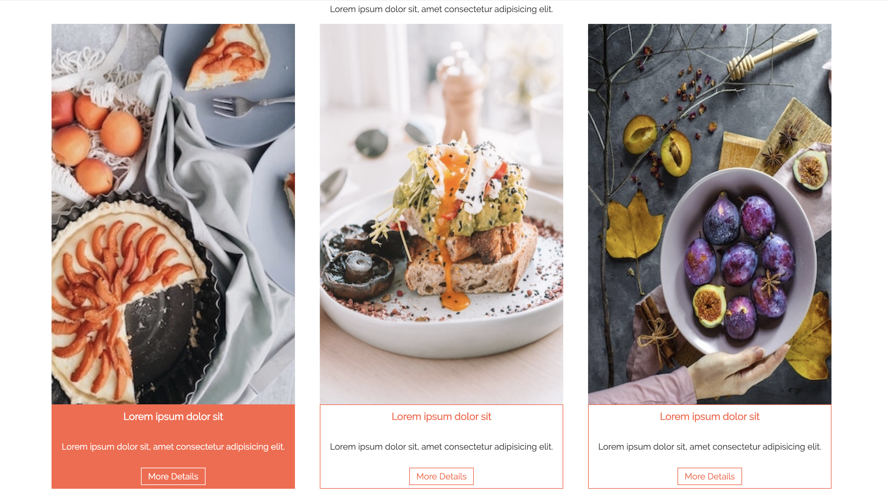
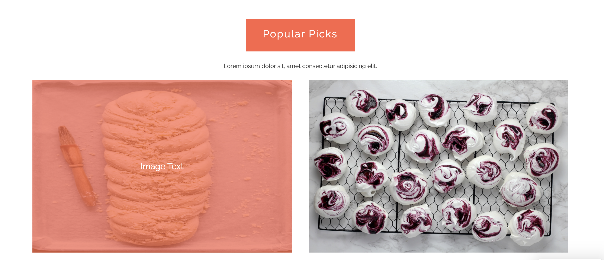
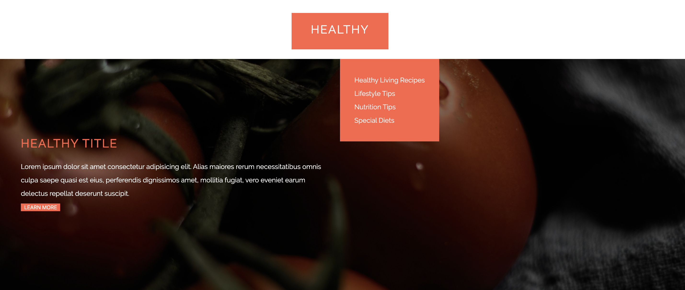
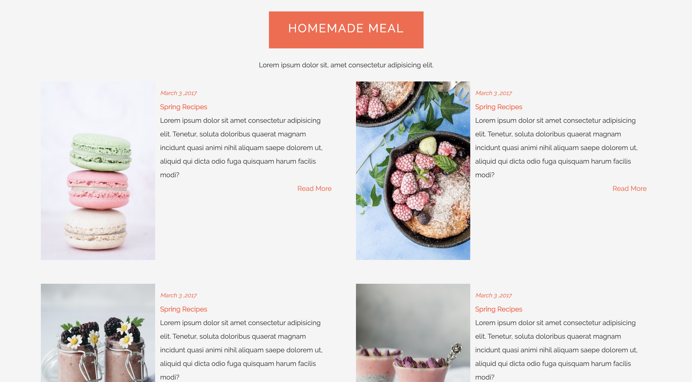
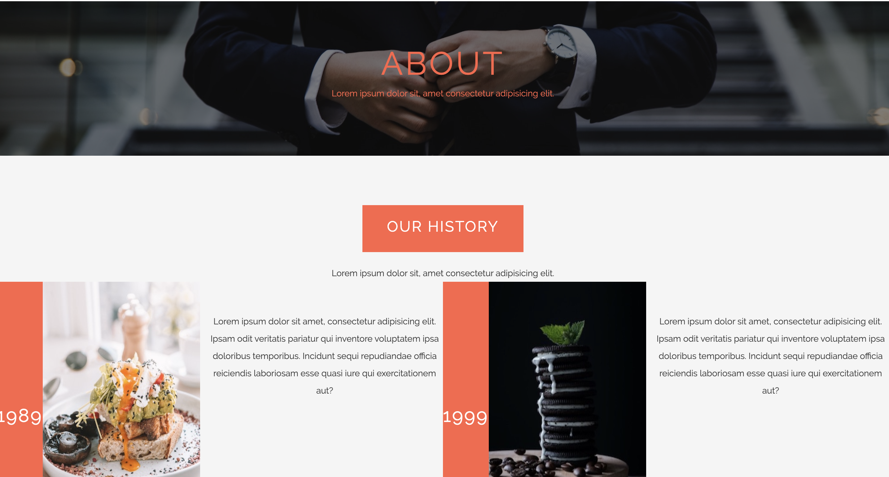
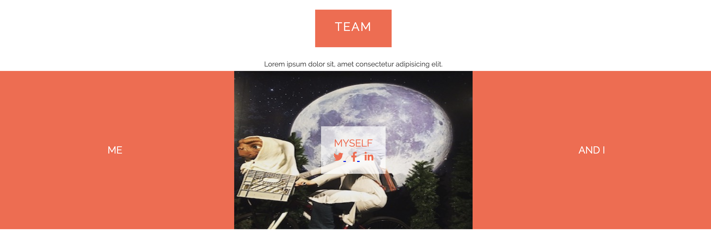
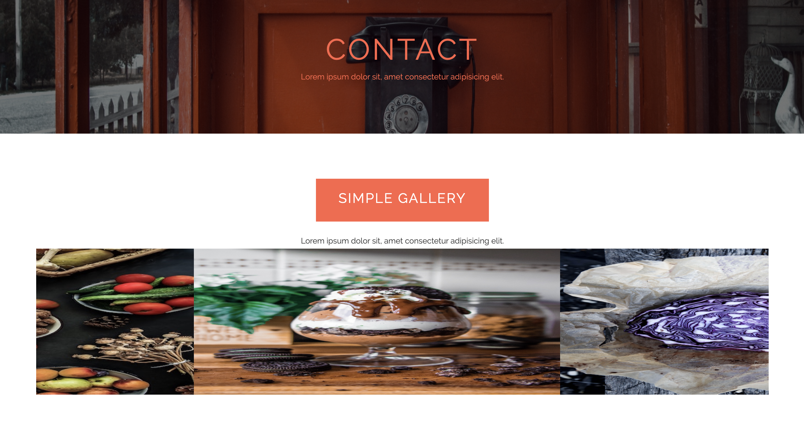
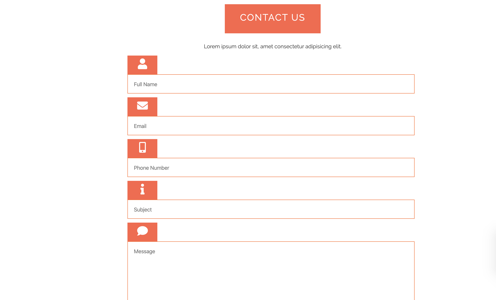
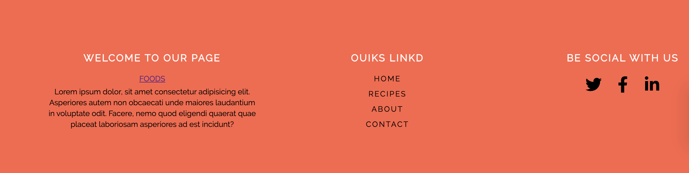

# FOODS
Pure HTML and CSS

Live Link: https://maryyfoods.netlify.com/

For this project,I am a person who likes to cook and eat, I prepared food page of my dream. I then crafted a multible page website that emphasized the following:

* Focused html & css detailed
* Ease of use and functionality.
* Updated design esthetic.
* Fully responsive.

## Key Technologies
 * HTML
 * CSS
 * Reset CSS
 * FontAwesome

<h2>Comparison</h2>
* Home

* Zoom Effect

* Overlay 

* Pallax

* Homemade

* About 

* Team

* Slide 

* Contact 

* footer

To see the full code, please visit  <a href="https://github.com/meryemkmr/FOODS"> FOODS</a>  on Github.

<h2>Author</h2>
Meryem Komur
